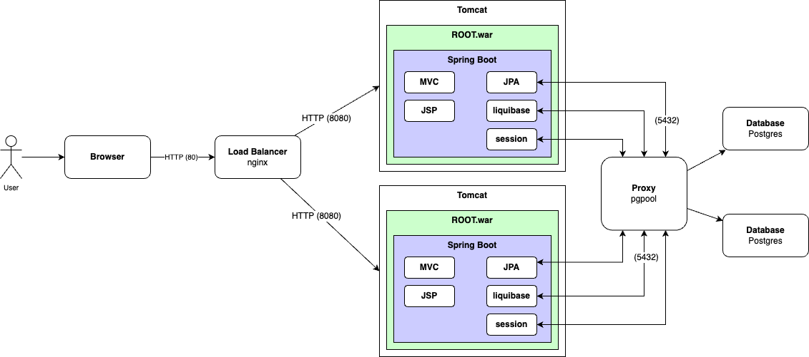
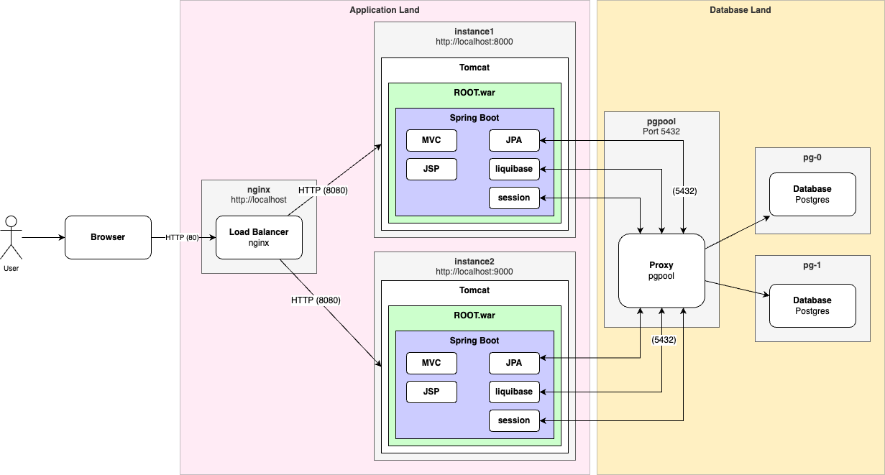
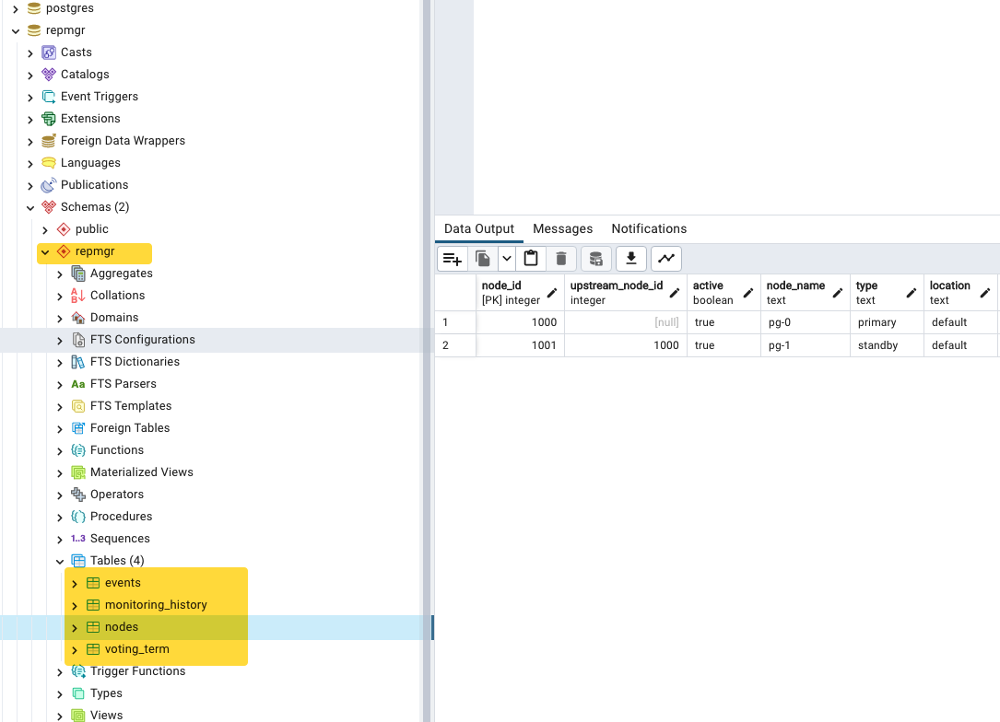

# System Delta

Prerequisites

- https://github.com/jvalentino/sys-alpha-bravo
- https://github.com/jvalentino/sys-charlie

This is an example system that it used to demonstrate different architectural approaches as they relate to scalability. Its core functions are the following:

- The system shall allow a user to add documents
- The system shall version documents
- The system shall allow a user to download a document

This specification implementation uses a load balancer to support multiple concurrent instances, in combination with a database cluster that is also used for session management.

## Previous System

**Multi-Backend (Rating: a hundred)**

Now to tackle the fact that we need more servers (and instances) to handle user load, we start adding more servers to run more backend instances. The result though is that we need a way to direct traffic to the appropriate instance based on load, which is where we get Load Balancers. A consequence though of using a load balancer with in-memory sessions though, is that only the instance which handles the initial user authentication has knowledge of that session, so that user is tied to that instance.

[](https://github.com/jvalentino/clothes-closet-wiki/blob/main/wiki/step-3.png)

Pros

- Backend and Database independent, allowing us to have different optimized servers.
- Multple backends allows us to handle more load from users.

Cons

- No separation between front-end and backend.
- Incentivizes a snowflake architecture by having to fine tune the server hardware differently.
- Session is maintained in server-memory, thus limiting the number of concurrent users.
- You are paying for that second instance even when you don't need it.
- The more data that goes into the database, the slower it performs.
- The database is now a prime bottlekneck.
- Core reliance on RDMS limits upper scalability.

With the implementation being:

[](https://github.com/jvalentino/sys-charlie/blob/main/wiki/step-3-impl.png)

## Current System

**Database Cluster (Rating: hundreds)**

Now it is time to handle the database being a bottleneck. We handle it the same way we always do, by adding more instances. At the same time though to really see support higher load, we can't have user session information in memory so we move it into the database instead, removing the need for sticky sessions.

[](https://github.com/jvalentino/clothes-closet-wiki/blob/main/wiki/step-4.png)

Pros

- Backend and Database independent, allowing us have different optimized servers.
- Multple backends allows us to handle more load from users.
- A database cluster removes the database from being the solo bottlekneck.
- Session is maintained in the database, taking it out of memory.

Cons

- No separation between front-end and backend.
- Incentivizes a snowflake architecture by having to fine tune the server hardware differently.
- You are paying for that second instance even when you don't need it.
- The more data that goes into the database, the slower it performs.
- The addition of database land tripled the budget in hardware costs.
- Core reliance on RDMS limits upper scalability.

# Architecture

## Changes

The code-level implementation is the exact same as the previous example, with the exception of switching from in memory session management to via JDBC. This entails the following changes:

**build.gradle**

```groovy
// Spring Session via JDBC
	implementation 'org.springframework.session:spring-session-jdbc'
```

There is an existing library for doing session management via JDBC.

**application.properties**

```properties
spring.session.store-type=jdbc
```

The session type has to then be specified in the application properties.

**changelog.sql**

```sql
-- changeset liquibase:3

CREATE TABLE SPRING_SESSION (
	PRIMARY_ID CHAR(36) NOT NULL,
	SESSION_ID CHAR(36) NOT NULL,
	CREATION_TIME BIGINT NOT NULL,
	LAST_ACCESS_TIME BIGINT NOT NULL,
	MAX_INACTIVE_INTERVAL INT NOT NULL,
	EXPIRY_TIME BIGINT NOT NULL,
	PRINCIPAL_NAME VARCHAR(100),
	CONSTRAINT SPRING_SESSION_PK PRIMARY KEY (PRIMARY_ID)
);

CREATE UNIQUE INDEX SPRING_SESSION_IX1 ON SPRING_SESSION (SESSION_ID);
CREATE INDEX SPRING_SESSION_IX2 ON SPRING_SESSION (EXPIRY_TIME);
CREATE INDEX SPRING_SESSION_IX3 ON SPRING_SESSION (PRINCIPAL_NAME);

CREATE TABLE SPRING_SESSION_ATTRIBUTES (
	SESSION_PRIMARY_ID CHAR(36) NOT NULL,
	ATTRIBUTE_NAME VARCHAR(200) NOT NULL,
	ATTRIBUTE_BYTES BYTEA NOT NULL,
	CONSTRAINT SPRING_SESSION_ATTRIBUTES_PK PRIMARY KEY (SESSION_PRIMARY_ID, ATTRIBUTE_NAME),
	CONSTRAINT SPRING_SESSION_ATTRIBUTES_FK FOREIGN KEY (SESSION_PRIMARY_ID) REFERENCES SPRING_SESSION(PRIMARY_ID) ON DELETE CASCADE
);


```

Finally, we have to add the tables needed for session management to our liquibase integration.

## Implementation

The resulting architecture then looks like this:



However, this probably doesn't make all the Docker magic clear, especially if you are not familiar with Docker. This is because Docker is being used to stitch all this together, while also making each part of the architecture accessible via localhost. The result is this:



## pgpool

> Pgpool-II is a middleware that works between PostgreSQL servers and a PostgreSQL database client. It is distributed under a license similar to BSD and MIT. It provides the following features.
>
> - Connection Pooling - Pgpool-II saves connections to the PostgreSQL servers, and reuse them whenever a new connection with the same properties (i.e. username, database, protocol version) comes in. It reduces connection overhead, and improves system's overall throughput.
> - Replication - Pgpool-II can manage multiple PostgreSQL servers. Using the replication function enables creating a realtime backup on 2 or more physical disks, so that the service can continue without stopping servers in case of a disk failure.
> - Load Balancing - If a database is replicated, executing a SELECT query on any server will return the same result. Pgpool-II takes an advantage of the replication feature to reduce the load on each PostgreSQL server by distributing SELECT queries among multiple servers, improving system's overall throughput. At best, performance improves proportionally to the number of PostgreSQL servers. Load balance works best in a situation where there are a lot of users executing many queries at the same time.
> - Limiting Exceeding Connections - There is a limit on the maximum number of concurrent connections with PostgreSQL, and connections are rejected after this many connections. Setting the maximum number of connections, however, increases resource consumption and affect system performance. pgpool-II also has a limit on the maximum number of connections, but extra connections will be queued instead of returning an error immediately.
> - Watchdog - Watchdog can coordinate multiple Pgpool-II, create a robust cluster system and avoid the single point of failure or split brain. Watchdog can perform lifecheck against other pgpool-II nodes, to detect a fault of Pgpoll-II. If active Pgpool-II goes down, standby Pgpool-II can be promoted to active, and take over Virtual IP.
> - In Memory Query Cache - In memory query cache allows to save a pair of SELECT statement and its result. If an identical SELECTs comes in, Pgpool-II returns the value from cache. Since no SQL parsing nor access to PostgreSQL are involved, using in memory cache is extremely fast. On the other hand, it might be slower than the normal path in some cases, because it adds some overhead of storing cache data.

https://pgpool.net/mediawiki/index.php/Main_Page

This is the endpoint that is used for the database, which then handles directing between multiple instances.

This allows you to connect to it using pgadmin for example, though it directs to the appropriate instance.

[](https://github.com/jvalentino/sys-charlie/blob/main/wiki/pgadmin.png)

Due to load balancing, there is now a schema for keeping track of the cluster health:



## pg-0

Uses the base image of bitnami/postgresql-repmgr:14, which is a Postgres instance intended to be a part of a cluster.

## pg-1

Uses the base image of bitnami/postgresql-repmgr:14, which is a Postgres instance intended to be a part of a cluster.

## instance1

This is running a Tomcat Application Server on its default port of 8080, which is then exposed locally as 8000 so that you can hit it directly in the web browser.

[](https://github.com/jvalentino/sys-charlie/blob/main/wiki/8000.png)

## Instance2

This is running a Tomcat Application Server on its default port of 8080, which is then exposed locally as 9000 so that you can hit it directly in the web browser.

[](https://github.com/jvalentino/sys-charlie/blob/main/wiki/9000.png)

## nginx

This is running nginx, but instead of as a standard web server it is acting as a load balancer. It is exposed locally on port 80, so when you go to [http://localhost](http://localhost/) it will forward behind the scenes to one of the two Tomcat instances.

[](https://github.com/jvalentino/sys-charlie/blob/main/wiki/localhost.png)

# Developer

Prerequisites

- Java
- IntelliJ
- Docker
- Docker Compose
- pgadmin
- Git

All of these you can get in one command using this installation automation (if you are on a Mac): https://github.com/jvalentino/setup-automation

## Database

You launch the database container by running:

```
docker compose up -d
```

This sill execute the container in detached mode, and leave it running in the background.

## IDE Testing

This imports as a standard Gradle project, in which you are able to easily execute tests:

[](https://github.com/jvalentino/sys-alpha-bravo/blob/main/wiki/testing.png)

## Runtime

However, running this thing requires an embedded Tomcat container, which I could only get working via the Gradle Plugin, which means I had to setup a Gradle task to run `tomcatRunWar`:

[](https://github.com/jvalentino/sys-alpha-bravo/blob/main/wiki/gradle.png)

IT doesn't shutdown nicely, to be prepared to run this command over and over again to kill it: `pkill -f tomcat`

You can otherwise do this at the command-line using `./gradlew tomcatRunWar`

## Verification

[](https://github.com/jvalentino/sys-alpha-bravo/blob/main/wiki/ide_check.png)

Running check will execute both testing and static code analysis via the build.

This is otherwise the same as doing this at the command-line: `./gradlew check`

## Strategy

Codenarc is used to ensure that no common coding issues can be added.

Jacoco is used to enforce that line coverage is over 85%.

Tests that end in "IntgTest" are used for integration testing via Spring Boot Test, otherwise they are unit tests.

Every code commit triggers a Github Action pipeline that runs the entire build process.

## Full System

You can run the entire system locally via Docker, but executing this script:

```
./run-system.sh
```

This just builds the war file and then execute the docker compose file that contains the system:

```
./gradlew clean build
docker compose -f docker-compose-system.yaml up -d
```

### Docker Compose

The real magic is in this docker compose file, which is:

```yaml
version: '3.8'

services:
  pg-0:
    container_name: delta-pg-0
    image: bitnami/postgresql-repmgr:14
    restart: always
    ports:
      - 5432
    volumes:
      - ./prod-db/pg_0_data:/bitnami/postgresql
    environment:
      - POSTGRESQL_POSTGRES_PASSWORD=postgres
      - POSTGRESQL_USERNAME=postgres
      - POSTGRESQL_PASSWORD=postgres
      - POSTGRESQL_DATABASE=examplesys
      - REPMGR_PASSWORD=postgres
      - REPMGR_PRIMARY_HOST=pg-0
      - REPMGR_PARTNER_NODES=pg-0,pg-1
      - REPMGR_NODE_NAME=pg-0
      - REPMGR_NODE_NETWORK_NAME=pg-0
  pg-1:
    container_name: delta-pg-1
    image: bitnami/postgresql-repmgr:14
    restart: always
    ports:
      - 5432
    volumes:
      - ./prod-db/pg_1_data:/bitnami/postgresql
    environment:
      - POSTGRESQL_POSTGRES_PASSWORD=postgres
      - POSTGRESQL_USERNAME=postgres
      - POSTGRESQL_PASSWORD=postgres
      - POSTGRESQL_DATABASE=examplesys
      - REPMGR_PASSWORD=postgres
      - REPMGR_PRIMARY_HOST=pg-0
      - REPMGR_PARTNER_NODES=pg-0,pg-1
      - REPMGR_NODE_NAME=pg-1
      - REPMGR_NODE_NETWORK_NAME=pg-1
  pgpool:
    container_name: delta-pgpool
    image: bitnami/pgpool:4
    restart: always
    ports:
      - 5432:5432
    environment:
      - PGPOOL_BACKEND_NODES=0:pg-0:5432,1:pg-1:5432
      - PGPOOL_SR_CHECK_USER=postgres
      - PGPOOL_SR_CHECK_PASSWORD=postgres
      - PGPOOL_ENABLE_LDAP=no
      - PGPOOL_POSTGRES_USERNAME=postgres
      - PGPOOL_POSTGRES_PASSWORD=postgres
      - PGPOOL_ADMIN_USERNAME=postgres
      - PGPOOL_ADMIN_PASSWORD=postgres
    healthcheck:
      test: ["CMD", "/opt/bitnami/scripts/pgpool/healthcheck.sh"]
      interval: 10s
      timeout: 5s
      retries: 5

  instance1:
    container_name: delta-instance-1
    image: tomcat:9-jdk11
    restart: always
    command: sh -c "
      sleep 60 &&
      cd /usr/local/tomcat/bin &&
      ls -la &&
      ./catalina.sh run"
    ports:
      - '8000:8080'
    environment:
      DB_HOST: pgpool
    volumes:
      - ./build/libs/sys-delta-0.0.1.war:/usr/local/tomcat/webapps/ROOT.war
    depends_on:
      - pg-0
      - pg-1
      - pgpool

  instance2:
    container_name: delta-instance-2
    image: tomcat:9-jdk11
    restart: always
    command: sh -c "
      sleep 60 &&
      cd /usr/local/tomcat/bin &&
      ls -la &&
      ./catalina.sh run"
    ports:
      - '9000:8080'
    environment:
      DB_HOST: pgpool
    volumes:
      - ./build/libs/sys-delta-0.0.1.war:/usr/local/tomcat/webapps/ROOT.war
    depends_on:
      - pg-0
      - pg-1
      - pgpool

  nginx:
    container_name: delta-load-balancer
    image: nginx:1.13
    ports:
      - "80:80"
    volumes:
      - ./config/nginx/nginx.conf:/etc/nginx/nginx.conf
    depends_on:
      - pg-0
      - pg-1
      - pgpool
      - instance1
      - instance2

```

At this point also consider that there is more code related to infrastructure, then there is for the application it is running. Hint: A reason for moving infrastructure to the Cloud is to avoid this kind of overhead.

### Postgres

The database clustering setup comes directly from https://hub.docker.com/r/bitnami/pgpool. This is because the best way to easily setup infrastructure is to look to see if:

1. Someone has already created an image that does what you need
2. Someone has already created a docker compose file for running it

If either of those things don't exist, get ready to have to spend a good deal of time figuring this out on your own. This generally requires a substantial amount of knowledge of the thing for which you are trying to containerize.

### Tomcat

You will notice an arbitrary sleep of 60 seconds prior to starting the container. This is because I couldn't get the health check to work like I wanted, where the pgpool service would not show as "up" until the cluster is connected. The result is the the Tomcat instances startup before the database is available and crash. My hack was to make Tomcat wait a minute before starting up so that it is reasonably assured for the database to be there.